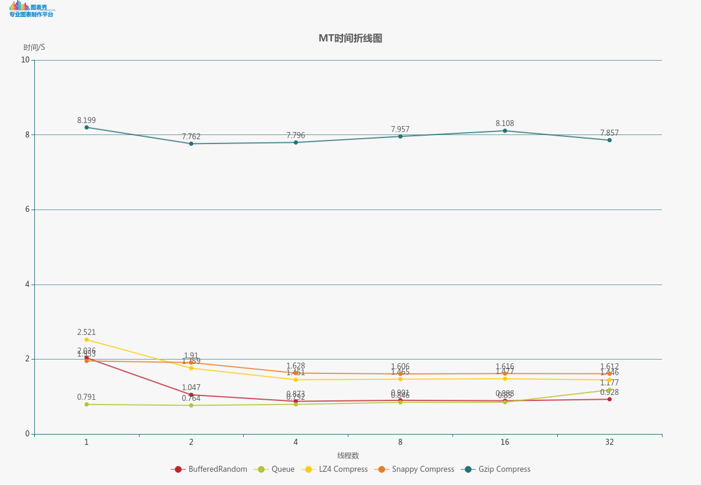
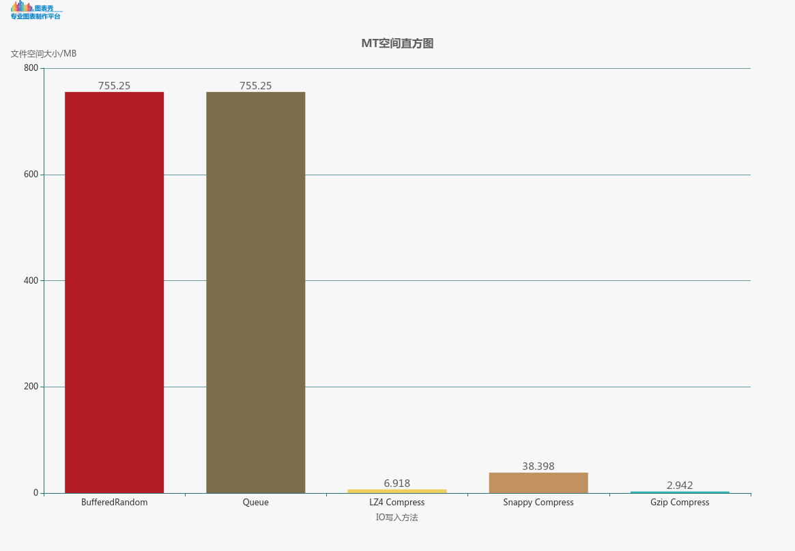
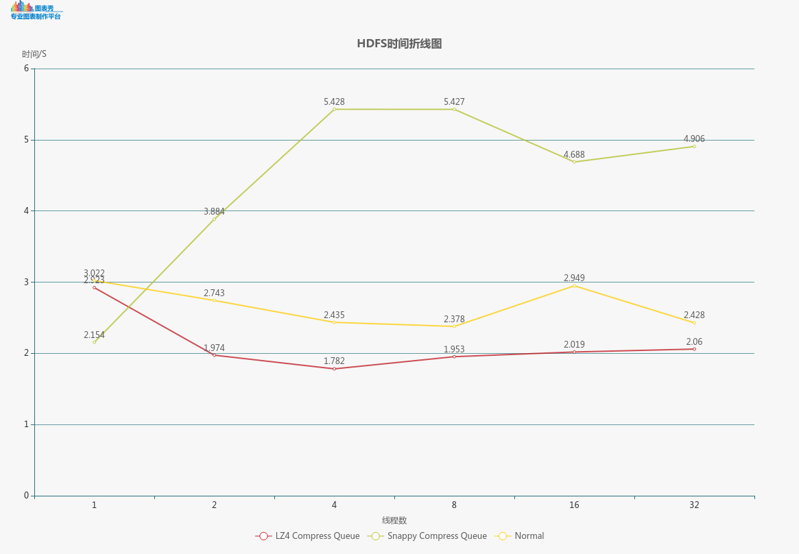
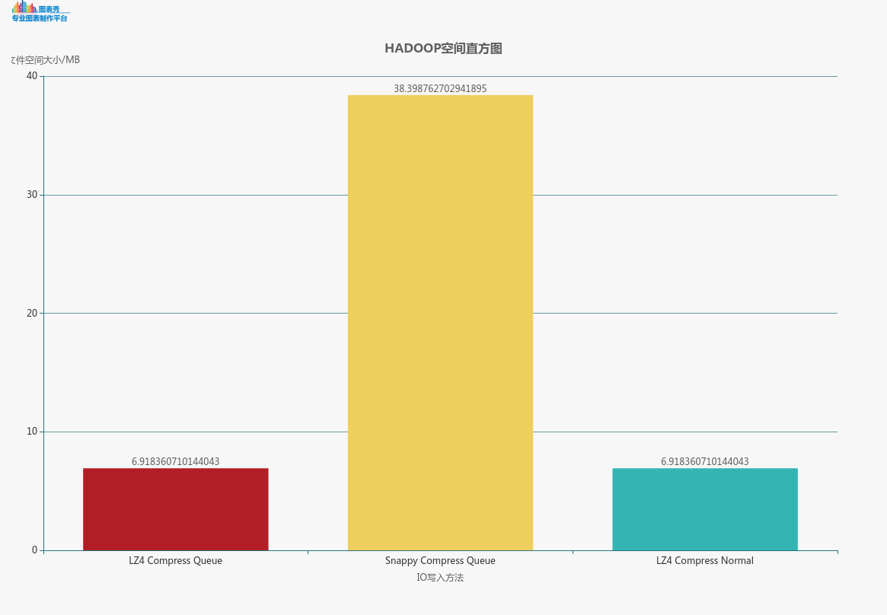
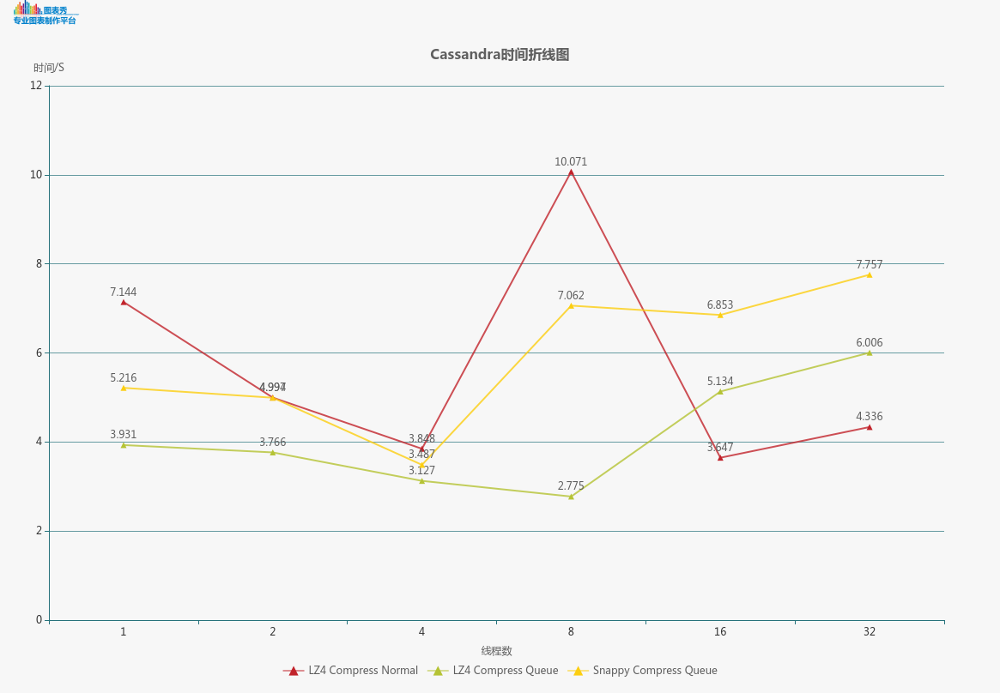
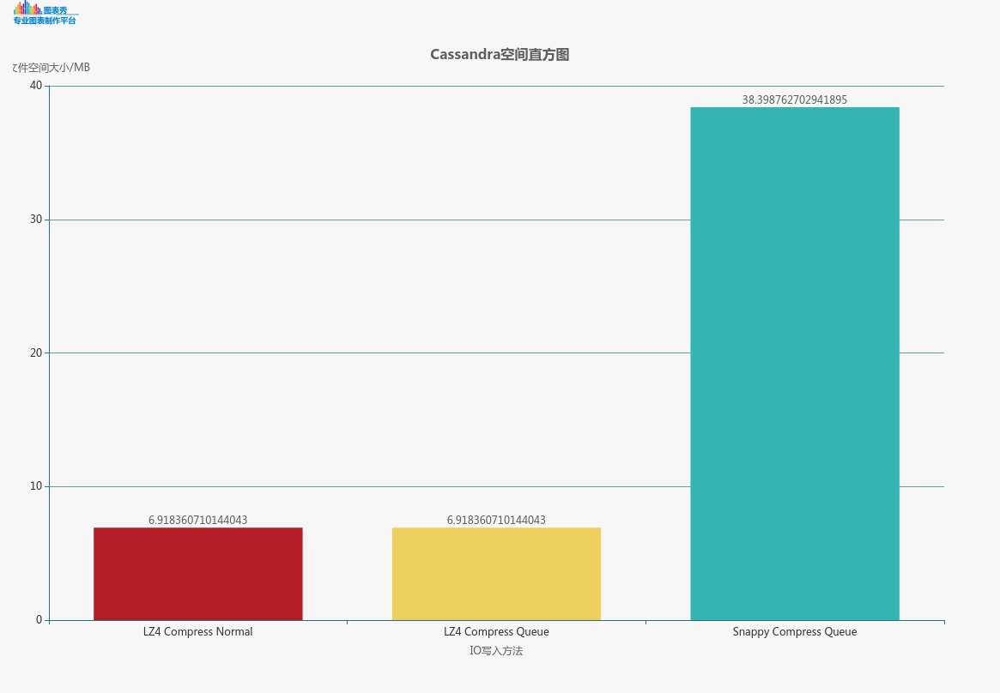

# DistributedComputeHomework
Java文件IO操作及HDFS编程文档

### 一、Java IO
五种IO写入策略分别是：
A)写后读再写：BufferedRandomAccessFile读写文件
B)边写边读再写：BufferedRandomAccessFile读写文件+Queue实现消息队列
C)写压缩后读再写：BufferedRandomAccessFile读写文件＋GZIP压缩
D)写压缩后读再写：BufferedRandomAccessFile读写文件＋LZ4压缩
E)写压缩后读再写：BufferedRandomAccessFile读写文件＋SNAPPY压缩

#### 1.IO时间折线图

##### 2.IO空间直方图

**分析：**
(1)首先所有随机读写的部分全部替换为BufferedRandomAccessFile，Java自带的RandomAccessFile速度很慢，重写RandomAccessFile，在此基础上做一个缓存会使速度大有提升。
(2)由于题中数据最大值可以只用三个byte存储，没有必要使用默认的4个byte存储。因此整体空间缩小了1/4。速度上也提升了不少。
(3)方式一速度很快，虽然数据没有进行压缩，但数据生成写入在一秒以内，主要取决于RandomAccessFile＋FileChannel的方式进行写入。之后多线程写入时间在毫秒级别。
(4)方式二采用文件边写边读的方式，速度是最快的，实现了一个公共读的队列TaskQueue，在数据生成的时候将写文件分成一个个任务，写的地方轮询读这个队列，并执行这个任务，以这种方式读写，数据生成完同时也就写完了。总时间大概在800ms，由于限制于单线程写，多线程读并没有太大的优势。
(5)方式三采用LZ4分块压缩的方式读写数据。可见数据压缩率很高，只剩7MB, 速度也很快，在两秒以内。
(6)方式四采用Snappy分块压缩的方式读写数据。相比较而言，速度很快，但压缩效率不是很好。
(7)方式三采用GZIP分块压缩的方式读写数据。可见数据压缩率很高，只剩3MB, 然而大部分时间花在了压缩上面。所以对读写再快也没有优势，必须优化压缩才能提高效率。

**总结：**
本次试验中，采用了很多文件IO方式，最后选择最快的三种作为展示。在实验要求下，采用分布式队列＋缓存随机读写机制的速度在本次试验中取得很好的效果，大约0.75m可完成任务。在本次实验中，对缓存块的大小进行了多次实验，最后采用速度较快的结果进行展示。在实际情况下，需要根据实际情况进行调参，才能达到更好的效果。

二、Hadoop　(多线程则生成多文件)
三种IO写入策略分别是：
A)先写后读再写入HDFS,　文件采用LZ4进行压缩。
B)边写边读边写入HDFS,  采用队列实现边写文件边读文件，文件采用LZ4进行压缩。
C)边写边读边写入HDFS,  采用队列实现边写文件边读文件，文件采用Snappy进行压缩

1、时间折线图

2、空间直方图

分析：
(1)、由于Hadoop文件系统文件大文件IO写入较慢，一开始测试后立即放弃无压缩的写入方式。
(2)、方式１采用压缩性能很高的LZ4进行文件压缩。采用队列＋缓存RandomAccessFile实现边写文件边读，再写入HDFS。由于压缩速度很快，而且采用块压缩，每一块压缩完成立即写文件，每写完一块则触发一个消息，放入队列。写HDFS的线程轮询读这个队列，去执行任务。这样一来，写文件的时间与生成的时间合二为一，提高了效率。
(3)、方式２采用与方式１同样的策略，只是数据压缩方式不同，速度上不及前者，主要在于文件传输。
(4)、方式３采用普通的先写后读再写策略，压缩采用LZ4算法。时间上必然会比前者慢。
总结：
HDFS的IO使用的是网络传输，必然不适合大文件传输，因此对数据进行压缩写入会大大提高效率。写入策略依然采用队列＋压缩效果最佳。

三、Cassandra
表结构：
CREATE TABLE keyspace_user22.number (
id int PRIMARY KEY,
data blob
)
数据已blob的形式存入Cassandra种。

三种IO写入策略：(采用远程写入的方式)
A)先写后读再写入HDFS,　文件采用LZ4进行压缩。
B)边写边读边写入HDFS,  采用队列实现边写文件边读文件，文件采用LZ4进行压缩。
C)边写边读边写入HDFS,  采用队列实现边写文件边读文件，文件采用Snappy进行压缩
　１、时间折线图

　２、空间折线图

分析：
采用java API插入数据，快速的做发依然是边写入文件系统便开始插入，这样写文件系统的时间几乎可以被忽略。

数据压缩依然采用LZ4和Snappy，不同的是，在这个写入中，为了避免平凡插入，我将快的大小变大，这样减少数据库连接，传输性能有所提高。

**总结：**
　　在三次系统中，采用队列＋多线程无疑是最快的写入方式，在考虑低带宽的情况下，适当对数据进行压缩会大大提高效率。

注意事项：
	本次实验是在先写入本地文件系统的条件下进行文件读写再写入其他文件系统，由于输出较多，另外加上空间限制，同一题目的文件会覆盖。程序的计时已在程序当中写好，会在控制台输出。上述图标在本机上测试所得。该程序引入第三方压缩包，还有工具类TaskQueue.java Task.java BufferedRandomAccessFile.java 除了jar包（附pom.xml)